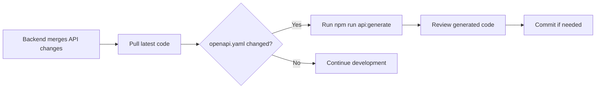

# 📚 API Generation - Complete Setup Summary

## ✅ What Was Created

### 1. Directory Structure
```
PawPlanet-frontend/
├── .github/
│   └── workflows/
│       └── generate-api.yml          # GitHub Actions workflow (optional)
├── openapi/
│   ├── .gitignore                    # Git ignore configuration
│   └── openapi.yaml                  # Downloaded OpenAPI spec (after first run)
├── scripts/
│   ├── generate-api.sh               # Bash script (Linux/Mac)
│   ├── generate-api.ps1              # PowerShell script (Windows)
│   ├── README.md                     # Full documentation
│   └── QUICK_START.md                # Quick reference guide
├── src/services/api/                 # Generated TypeScript client (after first run)
└── package.json                      # Updated with new scripts
```

### 2. NPM Scripts (Updated)

```json
{
  "scripts": {
    "api:generate": "powershell -ExecutionPolicy Bypass -File ./scripts/generate-api.ps1",
    "api:generate:bash": "bash ./scripts/generate-api.sh"
  }
}
```

## 🚀 How to Use

### First Time Setup
```bash
# Run the generation script
npm run api:generate

# This will:
# 1. Download openapi.yaml from backend repo
# 2. Generate TypeScript API client in src/services/api/
# 3. Create all necessary type definitions
```

### Regular Usage
```bash
# When backend API changes
npm run api:generate

# Or on Linux/Mac
npm run api:generate:bash
```

## 📋 Key Features

### ✅ No Backend Dependency
- Scripts fetch from GitHub, not from running backend server
- Works even when backend is down
- Always gets latest committed spec

### ✅ Version Controlled
- `openapi.yaml` tracked in git
- Easy to see API changes in PRs
- Can rollback if needed

### ✅ Controlled Updates
- Manual trigger prevents surprise changes
- Review before committing
- Clear audit trail

### ✅ Cross-Platform
- PowerShell script for Windows (default)
- Bash script for Linux/Mac
- Both do exactly the same thing

## 🔄 Workflow

### Developer Workflow


### When to Regenerate
1. ✅ After backend PR merge with API changes
2. ✅ When pulling code and see `openapi/openapi.yaml` modified
3. ✅ Starting new feature that uses new endpoints
4. ✅ Initial project setup

### When NOT to Regenerate
- ❌ Every time you pull code (only if spec changed)
- ❌ Before every build (unnecessary)
- ❌ In CI/CD build process (optional, use workflow instead)

## 📁 Generated Files Structure

After running the script, `src/services/api/` contains:

```typescript
// api.ts - Main API classes
export class DefaultApi {
  getAnimals() { ... }
  getAnimalById() { ... }
  // ... all backend endpoints
}

// configuration.ts - Config
export class Configuration {
  basePath?: string;
  accessToken?: string;
  // ...
}

// common.ts - Shared types
export interface Animal { ... }
export interface User { ... }

// index.ts - Barrel exports
export * from './api';
export * from './configuration';
// ...
```

## 💡 Usage Examples

### Basic Usage
```typescript
import { DefaultApi, Configuration } from '@/services/api';

const api = new DefaultApi(
  new Configuration({
    basePath: import.meta.env.VITE_API_BASE_URL
  })
);

const animals = await api.getAnimals();
```

### With Authentication
```typescript
import { DefaultApi, Configuration } from '@/services/api';

const api = new DefaultApi(
  new Configuration({
    basePath: import.meta.env.VITE_API_BASE_URL,
    accessToken: localStorage.getItem('token') || undefined
  })
);

const profile = await api.getUserProfile();
```

### With Custom Axios Instance
```typescript
import { DefaultApi } from '@/services/api';
import apiClient from '@/services/apiConfig';

const api = new DefaultApi(undefined, '', apiClient);
const animals = await api.getAnimals();
```

## 🛠 Troubleshooting

### Windows: "Running scripts is disabled"
```powershell
Set-ExecutionPolicy -ExecutionPolicy RemoteSigned -Scope CurrentUser
```

### Linux/Mac: "Permission denied"
```bash
chmod +x scripts/generate-api.sh
```

### "curl: command not found" (Windows)
- Use PowerShell script instead: `npm run api:generate`
- Or install Git for Windows (includes curl)

### "Failed to download OpenAPI spec"
- Check internet connection
- Verify backend repository URL is correct
- Ensure spec file exists at the specified path

### Generated files have errors
- Run `npm install` to ensure all dependencies are installed
- Check if `@openapitools/openapi-generator-cli` is in devDependencies
- Try deleting `src/services/api/` and regenerate

## 🔗 Additional Resources

### Documentation
- [scripts/README.md](../scripts/README.md) - Full documentation
- [scripts/QUICK_START.md](../scripts/QUICK_START.md) - Quick reference
- [docs/API_GENERATION.md](../docs/API_GENERATION.md) - Integration guide

### External Links
- [Backend Repository](https://github.com/levietducanh99/PawpPanet-backend)
- [OpenAPI Generator Docs](https://openapi-generator.tech/)
- [TypeScript Axios Generator](https://openapi-generator.tech/docs/generators/typescript-axios)

## 📞 Support

If you encounter issues:

1. Check [scripts/README.md](../scripts/README.md) troubleshooting section
2. Verify backend spec URL is accessible
3. Ensure all npm dependencies are installed
4. Check that write permissions exist for `src/services/api/`

## 🎯 Next Steps

1. ✅ Run `npm run api:generate` to generate initial client
2. ✅ Review generated files in `src/services/api/`
3. ✅ Update API imports in your components
4. ✅ Test API calls work correctly
5. ✅ Commit the generated files (optional)
6. ✅ Share with team in documentation

---

**Setup Date**: January 3, 2026  
**Maintained by**: PawPlanet Frontend Team  
**Version**: 1.0

